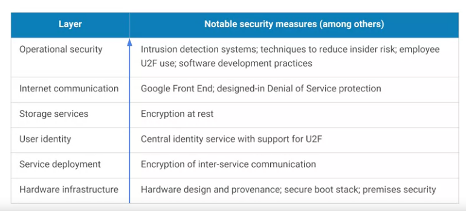
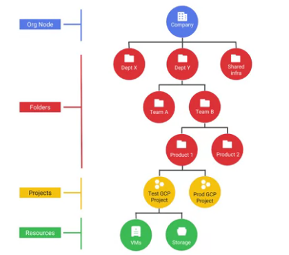
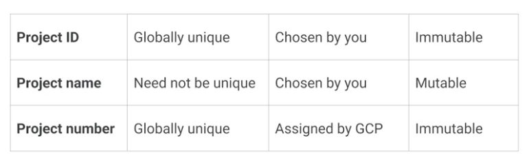

# Module 1

### Regions:

    As part of building a fault-tolerant application, you can spread your resources across multiple zones in a region.

    Why might a GCP customer use resources in several regions around the world?
        - To bring their applications closer to users around the world, and for improved fault tolerance

### Security

### Resource Hierachy

### Projects

    Have 3 unique identifying attributes:
        * Project ID
        * Project Name
        * Project Number

